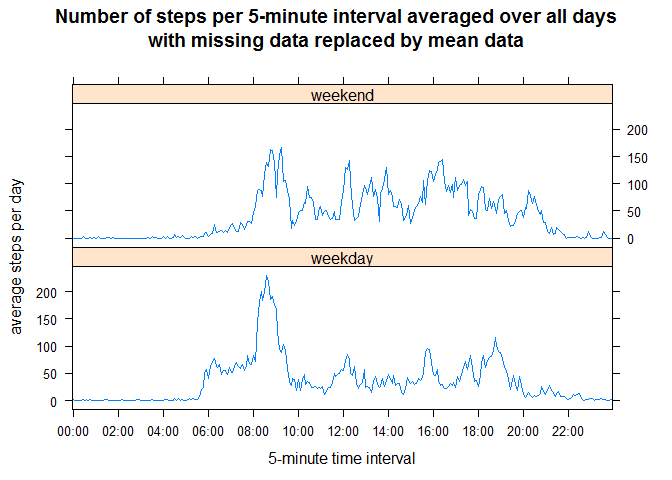

# Reproducible Research: Peer Assessment 1

## Introduction
Full details are provided on the course web site, available
[here](https://github.com/rdpeng/RepData_PeerAssessment1)
and in the Readme of this repository.

In summary, this assignment makes use of data from a personal activity monitoring
device which collects data at 5 minute intervals through out the day.
The data used in this assignment consists of two months of data from an anonymous
individual collected during the months of October and November, 2012, and includes
the number of steps taken during each 5 minute interval of each day.

The data was downloaded as a
[zip file](https://d396qusza40orc.cloudfront.net/repdata/data/activity.zip)
and the `activity.csv` data file was extracted from the zip file.

## Loading and preprocessing the data
The data was loaded from the `activity.csv` file in the current working directory:

```r
df <- read.csv("activity.csv")
str(df)
```

```
## 'data.frame':	17568 obs. of  3 variables:
##  $ steps   : int  NA NA NA NA NA NA NA NA NA NA ...
##  $ date    : Factor w/ 61 levels "2012-10-01","2012-10-02",..: 1 1 1 1 1 1 1 1 1 1 ...
##  $ interval: int  0 5 10 15 20 25 30 35 40 45 ...
```
The time interval is in an integer format, e.g. 925 corresponds to 09:25.
This is converted to an hour format and added as another factor in the dataframe:

```r
df$hour <- as.factor(
      paste(sprintf("%02i:%02i",df$interval%/%100, df$interval%%100 ),sep=":"))
str(df)
```

```
## 'data.frame':	17568 obs. of  4 variables:
##  $ steps   : int  NA NA NA NA NA NA NA NA NA NA ...
##  $ date    : Factor w/ 61 levels "2012-10-01","2012-10-02",..: 1 1 1 1 1 1 1 1 1 1 ...
##  $ interval: int  0 5 10 15 20 25 30 35 40 45 ...
##  $ hour    : Factor w/ 288 levels "00:00","00:05",..: 1 2 3 4 5 6 7 8 9 10 ...
```

## What is mean total number of steps taken per day?
The number of steps taken each day, ignoring missing values, is:

```r
steps_by_d <- with(df,tapply(steps, date, sum, na.rm=TRUE) )
str(steps_by_d)
```

```
##  int [1:61(1d)] 0 126 11352 12116 13294 15420 11015 0 12811 9900 ...
##  - attr(*, "dimnames")=List of 1
##   ..$ : chr [1:61] "2012-10-01" "2012-10-02" "2012-10-03" "2012-10-04" ...
```
which produces the following frequency histogram of the numbers of steps by day:

```r
hist(steps_by_d,breaks=20, xlab="Number of steps per day",
     main="Frequency Distribution of Steps by Day\nignoring missing data")
```

 

The mean total number of steps per day
(to 2 decimal places, ignoring missing values) is: 

```r
mean_by_d <- mean(steps_by_d, na.rm=TRUE)
cat(sprintf("%.2f",mean_by_d))
```

```
## 9354.23
```
and the median (ignoring missing values) is:

```r
med_by_d <- median(steps_by_d, na.rm=TRUE)
cat(med_by_d)
```

```
## 10395
```

## What is the average daily activity pattern?
The average number of steps per 5-minute interval, averaged across all days is:

```r
mean_steps_by_h <- with(df,tapply(steps, hour, mean, na.rm=TRUE) )
str(mean_steps_by_h)
```

```
##  num [1:288(1d)] 1.717 0.3396 0.1321 0.1509 0.0755 ...
##  - attr(*, "dimnames")=List of 1
##   ..$ : chr [1:288] "00:00" "00:05" "00:10" "00:15" ...
```
and a time series plot of this is:

```r
ticks <- seq(from=1,to=288,by=24)
xlabels=c(names(mean_steps_by_h)[ticks],"24:00")
xticks <- c(ticks,289)
plot(mean_steps_by_h, type="l", xaxt="n",
     xlab="5-minute time interval", ylab="average number of steps",
     main=paste("Number of steps per 5-minute interval averaged over all days",
                "ignoring missing data",sep="\n"))
axis(1, at=xticks, labels=xlabels)
```

 

The maximum number of average steps for a given 5-minute interval occurs at:

```r
cat(names(which.max(mean_steps_by_h)))
```

```
## 08:35
```
with an average number of steps (to 2 decimal places) of:

```r
cat(sprintf("%.2f",max(mean_steps_by_h)))
```

```
## 206.17
```
From the plot of average daily activity, this maximum appears as part of a
strong peak between 08:00 and 09:30. There is also a broader period of activity
from around 06:00 leading up to this peak, then various peaks and troughs in
activity throughout the rest of the day. Activity then declines gradually after
around 19:00 and towards midnight.

## Imputing missing values
The data set has missing values, coded by `NA`. The number of rows with missing values is:

```r
num_na_rows <- sum(is.na(df$steps))
cat(num_na_rows)
```

```
## 2304
```
If missing data is to be imputed then a suitable strategy is required.

### *Simple Strategy Considerations*

The number of missing values by day is:

```r
num_na_by_d <- with(df,tapply(is.na(steps),date,sum))
str(num_na_by_d)
```

```
##  int [1:61(1d)] 288 0 0 0 0 0 0 288 0 0 ...
##  - attr(*, "dimnames")=List of 1
##   ..$ : chr [1:61] "2012-10-01" "2012-10-02" "2012-10-03" "2012-10-04" ...
```
Since there are 288 5-minute intervals per day, the number of days with no data is:

```r
num_na_days <- sum(num_na_by_d==288)
cat(num_na_days)
```

```
## 8
```
and the number of days with partial data is:

```r
num_part_days <- sum(num_na_by_d%in%1:287)
cat(num_part_days)
```

```
## 0
```
So each day either has all data, or no data.

Similarly, the number of missing values by time of day is:

```r
num_na_by_h <- with(df,tapply(is.na(steps),hour,sum))
str(num_na_by_h)
```

```
##  int [1:288(1d)] 8 8 8 8 8 8 8 8 8 8 ...
##  - attr(*, "dimnames")=List of 1
##   ..$ : chr [1:288] "00:00" "00:05" "00:10" "00:15" ...
```
Since there are 61 days of data in this data set, the number of intervals with no data is:

```r
num_na_ints <- sum(num_na_by_h==61)
cat(num_na_ints)
```

```
## 0
```
and the number of intervals with partial data is:

```r
num_part_ints <- sum(num_na_by_h%in%1:60)
cat(num_part_ints)
```

```
## 288
```
Consideration of the number of days with or without data, as determined above,
suggests that all time intervals should have the same amount of data.
The distribution of the missing values confirms this:

```r
summary(num_na_by_h)
```

```
##    Min. 1st Qu.  Median    Mean 3rd Qu.    Max. 
##       8       8       8       8       8       8
```

Therefore, a simple strategy for the imput of missing data in this dataset should 
not be based on daily data since 8 days have no data.
Rather, it should be based on the mean or median data for each 5-minute interval since
each 5-minute interval has 53 days of data.

The mean number of steps per 5-minute interval `mean_steps_by_h` was determined
in the initial analysis.

The median number of steps per 5-minute interval is:

```r
med_steps_by_h <- with(df,tapply(steps, hour, median, na.rm=TRUE) )
```
It can be seen that the shapes of the distributions for the means and the medians
are quite different:

```r
summary(mean_steps_by_h)
```

```
##    Min. 1st Qu.  Median    Mean 3rd Qu.    Max. 
##   0.000   2.486  34.110  37.380  52.830 206.200
```

```r
summary(med_steps_by_h)
```

```
##    Min. 1st Qu.  Median    Mean 3rd Qu.    Max. 
##   0.000   0.000   0.000   3.962   0.000  60.000
```
Therefore, it is likely that results obtained after imputing missing values will
differ depending on whether the mean or the median data is used.
Both options are now analysed for comparison.

### *Imputing the data*

Copy the original data into two new data frames:

```r
df2 <- df
df3 <- df
```
The data rows with missing steps values are:

```r
rows_na <- which(is.na(df$steps))
str(rows_na)
```

```
##  int [1:2304] 1 2 3 4 5 6 7 8 9 10 ...
```
Replace these with the mean step data in `df2` and the median step data in `df3`:

```r
df2$steps[rows_na] <- mean_steps_by_h[df$hour[rows_na]]
str(df2)
```

```
## 'data.frame':	17568 obs. of  4 variables:
##  $ steps   : num  1.717 0.3396 0.1321 0.1509 0.0755 ...
##  $ date    : Factor w/ 61 levels "2012-10-01","2012-10-02",..: 1 1 1 1 1 1 1 1 1 1 ...
##  $ interval: int  0 5 10 15 20 25 30 35 40 45 ...
##  $ hour    : Factor w/ 288 levels "00:00","00:05",..: 1 2 3 4 5 6 7 8 9 10 ...
```

```r
df3$steps[rows_na] <- med_steps_by_h[df$hour[rows_na]]
str(df3)
```

```
## 'data.frame':	17568 obs. of  4 variables:
##  $ steps   : int  0 0 0 0 0 0 0 0 0 0 ...
##  $ date    : Factor w/ 61 levels "2012-10-01","2012-10-02",..: 1 1 1 1 1 1 1 1 1 1 ...
##  $ interval: int  0 5 10 15 20 25 30 35 40 45 ...
##  $ hour    : Factor w/ 288 levels "00:00","00:05",..: 1 2 3 4 5 6 7 8 9 10 ...
```
Confirm that there are no missing values in either:

```r
cat(sum(is.na(df2$steps)))
```

```
## 0
```

```r
cat(sum(is.na(df3$steps)))
```

```
## 0
```

Repeat some of the initial analysis with the imputed data.

### *Missing values replaced by mean data*

The number of steps taken each day
(with missing values replaced by mean data) is:

```r
steps_by_d2 <- with(df2,tapply(steps, date, sum) )
str(steps_by_d2)
```

```
##  num [1:61(1d)] 10766 126 11352 12116 13294 ...
##  - attr(*, "dimnames")=List of 1
##   ..$ : chr [1:61] "2012-10-01" "2012-10-02" "2012-10-03" "2012-10-04" ...
```
which produces the following frequency histogram of the numbers of steps by day:

```r
hist(steps_by_d2,breaks=20, xlab="Number of steps per day",
     main=paste("Frequency Distribution of Steps by Day",
                "with missing data replaced by mean data",sep="\n"))
```

 

The mean number of steps per day
(to 2 decimal places, with missing values replaced by mean data) is: 

```r
mean_by_d2 <- mean(steps_by_d2)
cat(sprintf("%.2f",mean_by_d2))
```

```
## 10766.19
```
and the change in mean steps per day
(to 2 decimal places, with missing values replaced by mean data) is:

```r
mean_diff2 <- mean_by_d2-mean_by_d
cat(sprintf("%.2f", mean_diff2))
```

```
## 1411.96
```
which is a percentage change of:

```r
mean_diff2_pc <- 100.0*mean_diff2/mean_by_d
cat(sprintf("%.1f%%", mean_diff2_pc))
```

```
## 15.1%
```

The median (with missing values replaced by mean data) is:

```r
med_by_d2 <- median(steps_by_d2)
cat(med_by_d2)
```

```
## 10766.19
```
and the change in median steps per day
(with missing values replaced by mean data) is:

```r
med_diff2 <- med_by_d2-med_by_d
cat(med_diff2)
```

```
## 371.1887
```
which is a percentage change of:

```r
med_diff2_pc <- 100.0*med_diff2/med_by_d
cat(sprintf("%.1f%%", med_diff2_pc))
```

```
## 3.6%
```

### *Missing values replaced by median data*

The number of steps taken each day
(with missing values replaced by median data) is:

```r
steps_by_d3 <- with(df3,tapply(steps, date, sum) )
str(steps_by_d3)
```

```
##  int [1:61(1d)] 1141 126 11352 12116 13294 15420 11015 1141 12811 9900 ...
##  - attr(*, "dimnames")=List of 1
##   ..$ : chr [1:61] "2012-10-01" "2012-10-02" "2012-10-03" "2012-10-04" ...
```
which produces the following frequency histogram of the numbers of steps by day:

```r
hist(steps_by_d3,breaks=20, xlab="Number of steps per day",
     main=paste("Frequency Distribution of Steps by Day",
                "with missing data replaced by median data",sep="\n"))
```

 

The mean number of steps per day
(to 2 decimal places, with missing values replaced by median data) is: 

```r
mean_by_d3 <- mean(steps_by_d3)
cat(sprintf("%.2f",mean_by_d3))
```

```
## 9503.87
```
and the change in mean steps per day
(to 2 decimal places, with missing values replaced by median data) is:

```r
mean_diff3 <- mean_by_d3-mean_by_d
cat(sprintf("%.2f", mean_diff3))
```

```
## 149.64
```
which is a percentage change of:

```r
mean_diff3_pc <- 100.0*mean_diff3/mean_by_d
cat(sprintf("%.1f%%", mean_diff3_pc))
```

```
## 1.6%
```

The median (with missing values replaced by median data) is:

```r
med_by_d3 <- median(steps_by_d3)
cat(med_by_d3)
```

```
## 10395
```
and the change in median steps per day
(with missing values replaced by median data) is:

```r
med_diff3 <- med_by_d3-med_by_d
cat(med_diff3)
```

```
## 0
```
which is a percentage change of:

```r
med_diff3_pc <- 100.0*med_diff3/med_by_d
cat(sprintf("%.1f%%", med_diff3_pc))
```

```
## 0.0%
```

When missing values are simply ignored, the days with missing values for the
number of steps have fewer steps accredited to their totals. However, those
days are not ignored, rather, their totals are reduced. In the cases where a
day only has missing values, the day will have a total of 0 steps.
For the data analysed here, 8 days have only missing values and
0 days have some, but not all, missing values.
This results in a high peak at the '0' bin in the histogram.

When missing values are replaced with the mean data, the days with missing
values move to a position towards the centre of the histogram increasing the
height of the main peak.
The mean number of steps per day increases by 15.1%
and the median increases by 3.6%.

When missing values are replaced with the median data, the days with missing
values have steps accredited to their totals according to the median for each
given time interval. The peak for these days moves away from the '0' bin,
though not by much due to the skew in the distribution of medians.
If a larger histogram bin size is used (fewer breaks) then this effect is not
seen as this shift remains within the width of the bin.
The mean number of steps per day increases by 1.6%
and the median remains the same.

## Are there differences in activity patterns between weekdays and weekends?

This analysis builds on `df2`, the data frame from the previous analysis in which
missing values have been replaced by mean data.

`as.POSIXlt()$wday` 
will give the weekday of a date as a number from 0 to 6, with Sunday as 0.
Therefore, weekdays are in the range 1 to 5, with weekend days being the remainder.

Add a factor indicating whether a day is a weekday or a weekend day:

```r
df2$daytype <- as.factor(as.POSIXlt(strptime(df2$date, "%Y-%m-%d"))$wday %in% 1:5 )
levels(df2$daytype) <- c("weekend","weekday")
summary(df2$daytype)
```

```
## weekend weekday 
##    4608   12960
```

Determine the average number of steps per day for each 5-minute time interval
split by the day type, and 
add this aggregated data to a new data frame along with the time interval factors:

```r
df_w <- as.data.frame(with(df2,tapply(steps, list(hour,daytype), mean, na.rm=TRUE)))
df_w$hour <- as.factor(levels(df2$hour))
str(df_w)
```

```
## 'data.frame':	288 obs. of  3 variables:
##  $ weekend: num  0.21462 0.04245 0.01651 0.01887 0.00943 ...
##  $ weekday: num  2.251 0.445 0.173 0.198 0.099 ...
##  $ hour   : Factor w/ 288 levels "00:00","00:05",..: 1 2 3 4 5 6 7 8 9 10 ...
```

Plot a two panel lattice plot showing the average number of steps per 5-minute interval,
averaged across all days, by weekday or weekend:

```r
library(lattice)
xyplot(weekday+weekend~hour,df_w, type="l",outer=TRUE,layout=c(1,2),
       ylab="average steps per day",xlab="5-minute time interval",
       scales=list(x=list(at=xticks,labels=xlabels)),
       main=paste("Number of steps per 5-minute interval averaged over all days",
                "with missing data replaced by mean data",sep="\n"))
```

 

The plot of average weekday daily activity is very similar to that for the
daily activity shown above. This is understandable since 71% of the daily data
is from weekdays. The weekend data does not have the broad period of activity
leading up to the peak around 08:30-09:30. It also has a higher period of activity
after 20:00 in the evening, which is absent in the weekday data.

Further analysis might include changing the imputed data strategy so that missing
data from weekend days is replaced by the mean data determined only from weekend
days and not from all days. And similarly, for the weekday data.
